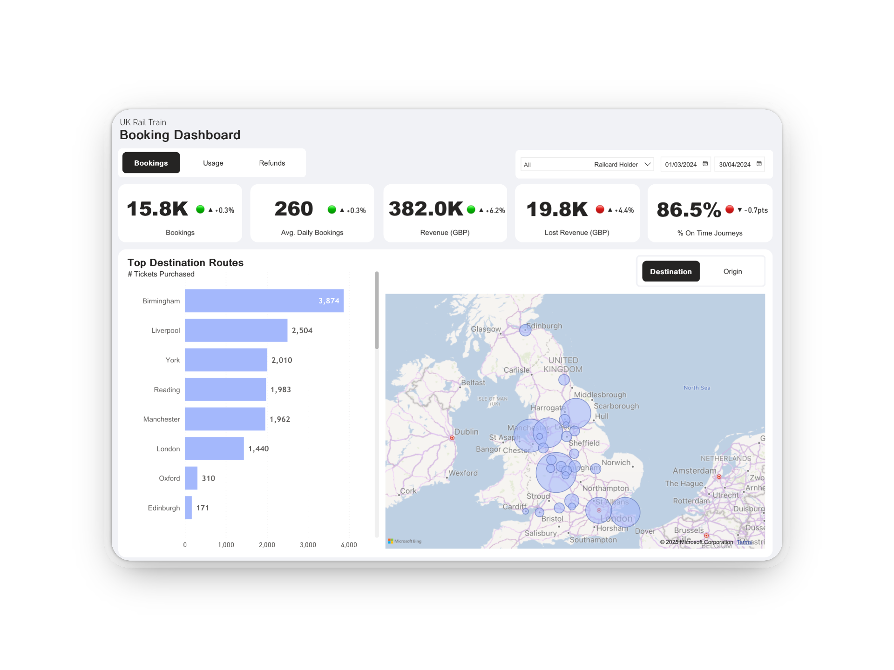

# Power BI Project: Booking Analysis Dashboard

## 📖 Overview
Providing a comprehensive view of booking analysis and visualization for National Rail in the UK, helping track purchase trends, analyze Railcard usage, and identify refund patterns.

👉 [Power BI Dashboard](https://app.powerbi.com/view?r=eyJrIjoiMjhjMGJhYWYtYWE4Ny00YWQ0LWJlNjAtNzQ2Yjk4YmQzZGQzIiwidCI6IjdkNDg3NDc4LWNhMjYtNDkxOS05MDlhLTBjNDU3MTQyYzczNCJ9&pageName=54e34d8c24a1d920c519)

## 📁 Data Model

→ `railway_booking.csv` 

| Column               | Type        | Description                                |
|----------------------|------------|--------------------------------------------|
| Transaction ID       | text       | Unique identifier for each purchase        |
| Date of Purchase     | date       | Date when the ticket was purchased         |
| Time of Purchase     | time       | Time when the ticket was purchased         |
| Purchase Type        | text       | Type of purchase (online, counter, app)   |
| Payment Method       | text       | Method used for payment (card, cash, etc.)|
| Railcard             | text       | Railcard used, if any                      |
| Ticket Class         | text       | Class of the ticket (Standard, First)     |
| Ticket Type          | text       | Type of ticket (Single, Return, Season)   |
| Price                | float      | Price paid for the ticket                  |
| Departure Station    | text       | Station from which the journey started    |
| Arrival Destination  | text       | Station where the journey ended            |
| Date of Journey      | date       | Scheduled date of travel                   |
| Departure Time       | time       | Scheduled departure time                   |
| Arrival Time         | time       | Scheduled arrival time                     |
| Actual Arrival Time  | time       | Real arrival time                           |
| Journey Status       | text       | Status of the journey (On time, Delayed)  |
| Reason for Delay     | text       | Reason for delay, if any                   |
| Refund Request       | boolean    | Whether a refund was requested             |

## 📊 Dashboard 

#### KPIs (Bookings Report - March 2024)
1. **Bookings:** 194.8K (+2.4% MoM).
2. **Revenue:** £261K (+15% MoM).
3. **Average Daily Bookings:** 10.5K (+2.4% MoM).
4. **Lost Revenue:** £10.5K (+24% MoM).
5. **On-Time Journeys:** 85.9% (-1.2pts MoM).

#### KPIs (Usage Report - March 2024)
1. **Bookings on Weekends (%):** 46.3% (-2.4pts MoM)
2. **Bookings on Weekends (%):**  53.7% (-2.4pts MoM).
3. **Average Advance Purchase:** 1 day (-4 days MoM).
4. **Average ticket price:** £24 (+12.3pts MoM)
5. **Online purchase (%):** 58.0% (-1.6pts MoM)

#### KPIs (Refunds Report - March 2024)
1. **Refundable Tickets (%):** 14.1% (+1.2pts MoM).
2. **Refunded Tickets (out of refundable - %):** 26.9% (+1.6pts MoM).
3. **Refunded Revenue:** 5.4% (+0.4pt MoM).
4. **Delayed Journeys:** 7.9% (+0.6pt MoM).
5. **Cancelled journeys:** 6.1% (+0.6pt MoM).

## 📈 Key Learnings:
- Most purchased tickets are Advance, followed by Off-Peak and Anytime.
- Most of the tickets are bought online (59%) rather at the station.
- Almost 9 out of 10 tickets are booked on the same day or one day before departure.
- Bookings peak in the morning (7–9 AM) and evening (5–7 PM), with lows at night and midday.
- The booking pattern also varies significantly depending on the ticket type:
  - Advance tickets are usually bought in the morning (8–9 AM) and the evening (5–8 PM), regardless of whether it is a weekday or weekend.
  - Off-Peak tickets seem to be more seasonal, with high volumes typically booked on weekends (Friday through Sunday). They are most often purchased early in the morning (5–7 AM) and in the afternoon (2–6 PM). There was also an isolated spike on March 23, 2024, suggesting a one-off event.
  - Anytime tickets are mainly booked during weekdays, typically within office hours, and are rarely purchased on weekends—likely reflecting business travel needs.
- **It looks like there was a promotional period to drive early booking** → see Early Bookings Analysis in `analysis`

## 🛠️ Technology Stack
- Power BI, PostgreSQL, Python, VS Code , Github

## ℹ️ Data Source
[Meaven Analytics](https://mavenanalytics.io/data-playground?order=date_added%2Cdesc&pageSize=20)

## 👨‍💻 Author
**Jacques Hervochon** 🟦 [LinkedIn](https://www.linkedin.com/in/jacques-hervochon-27448898) |
🔗 [Portfolio](https://jacqueshervochon.carrd.co/#) |
📆 [Book a call](https://calendly.com/jacqueshervochon/30min)

## 📄 License 
This project is licensed under the MIT License.
